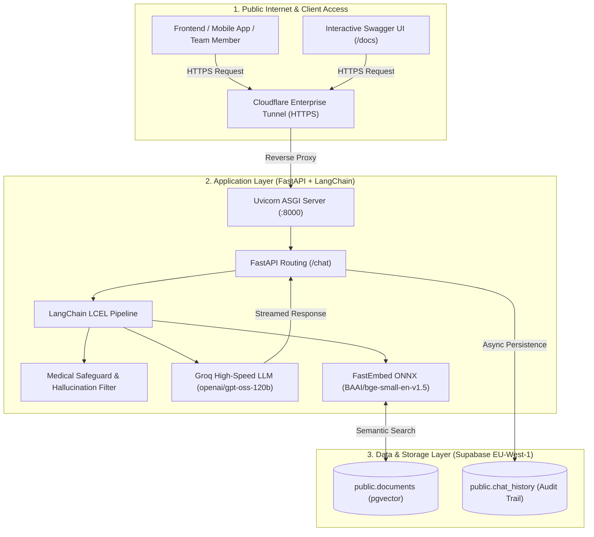

 System Overview & Architecture

enterprise-grade AI service built with FastAPI, LangChain (LCEL), Groq LLM inference, and Supabase (PostgreSQL with `pgvector`). It features strict clinical guardrails against medical hallucinations, local ONNX embeddings, real-time conversation logging, and a zero-cost public HTTPS deployment.

---

