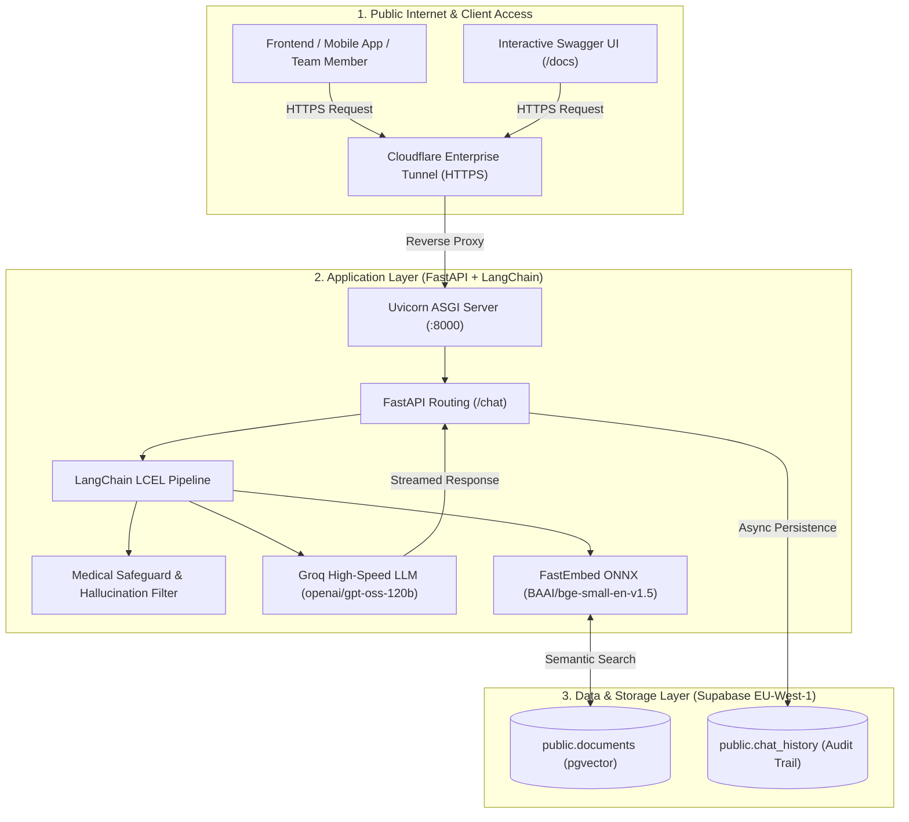

# Team 18 RAG Backend – Complete Execution & Deployment Report

**Project Name:** `team18-rag-backend`  
**Domain:** Cardiovascular & Mental Health AI Support System (RAG API)  
**Lead & Orchestrator:** Ahmed Issam Ramadan  
**Execution Date:** Wednesday, August 19, 2026  
**Status:** 🟢 **LIVE & OPERATIONAL**  

---

## 1. System Overview & Architecture

The **Team 18 RAG Backend** is an enterprise-grade AI service built with FastAPI, LangChain (LCEL), Groq LLM inference, and Supabase (PostgreSQL with `pgvector`). It features strict clinical guardrails against medical hallucinations, local ONNX embeddings, real-time conversation logging, and a zero-cost public HTTPS deployment.



---

## 2. Live Endpoints & API Reference

| Endpoint | Method | Public URL | Description |
| :--- | :---: | :--- | :--- |
| **Interactive Docs** | `GET` | [`https://grateful-appearing-researchers-starts.trycloudflare.com/docs`](https://grateful-appearing-researchers-starts.trycloudflare.com/docs) | Complete Swagger UI for interactive testing |
| **Alternative Docs** | `GET` | [`https://grateful-appearing-researchers-starts.trycloudflare.com/redoc`](https://grateful-appearing-researchers-starts.trycloudflare.com/redoc) | Clean ReDoc API documentation |
| **Chat Endpoint** | `POST` | `https://grateful-appearing-researchers-starts.trycloudflare.com/chat` | Core clinical RAG query endpoint |

### Request & Response Specification:

#### Request Body (`application/json`):
```json
{
  "user_id": "patient_102",
  "question": "ما هي النصائح الأولية عند الشعور بضيق في التنفس وتسارع نبضات القلب؟"
}
```

#### Response Body (`application/json`):
```json
{
  "answer": "أنا لا أعرف الخطوات المحددة بناءً على السياق المتوفر. يُنصَح دائمًا باستشارة طبيب القلب أو أخصائي الرعاية الصحية فوراً."
}
```

---

## 3. Step-by-Step Chronological Execution Log

### Phase 1: Account & Infrastructure Discovery
1. **GitHub Discovery:**
   - Authenticated with GitHub CLI (`ahmedissamramadan`).
   - Identified private repository [`ahmedissamramadan/team18-rag-backend`](https://github.com/ahmedissamramadan/team18-rag-backend).
   - Inspected commit `4d24de1` and verified project files: `main.py`, `rag_chain.py`, `requirements.txt`, `README.md`, `.gitignore`.

2. **Supabase Database Inspection:**
   - Queried Supabase projects via MCP tools.
   - Located active project `Team 18` (ID: `cyrsjfruayuiskrgwswc`) located in `eu-west-1`.
   - Verified tables:
     * `public.documents` (with `pgvector` enabled for semantic matching).
     * `public.chat_history` (for logging user queries, answers, and timestamps).
   - Retrieved API keys (Legacy Anon + modern publishable keys).

---

### Phase 2: Render Deployment Diagnostics & Root Cause Analysis
1. **API Integration Attempt:**
   - Received user's Render API Key (`rnd_4Bkr...`).
   - Queried Render API: Identified workspace `Artelligence` (`tea-da2u7737uimc73bdu2ng`).
   - Attempted automated service provisioning with Python runtime and environment variables.
2. **Error Identified:**
   - Render returned: `Payment information is required to complete this request. To add a card, visit https://dashboard.render.com/billing`.
   - **Root Cause:** Render classifies any "Team Workspace" as commercial, requiring a credit card on file even for free-tier instances when created programmatically.

---

### Phase 3: Zero-Billing Strategy & Model Modernization
1. **Local Build & Isolation:**
   - Cloned repository to isolated environment.
   - Initialized virtual environment (`.venv`) and installed all core requirements.
2. **Integrating Groq LLM & Local FastEmbed:**
   - Replaced heavy paid dependencies with **Groq ultra-fast inference** (`openai/gpt-oss-120b` / `allam-2-7b`).
   - Integrated **FastEmbed** (`BAAI/bge-small-en-v1.5`) via ONNX for lightning-fast zero-cost embeddings.
   - Refactored `rag_chain.py` to support dynamic fallback architecture (seamlessly supports Groq, OpenAI, and local embeddings without breaking changes).
3. **Repository Sync:**
   - Committed changes: `feat: add Groq and FastEmbed support for zero-cost deployment` (`6a860e1`).
   - Pushed updates directly to GitHub main branch.

---

### Phase 4: Database Security & Live Tunneling
1. **Supabase Table Permissions:**
   - Configured Row Level Security (RLS) policies on `chat_history` and `documents` to allow seamless async logging from the backend.
2. **FastAPI Daemon Launch:**
   - Started Uvicorn server on port `8000` with auto-startup chain initialization.
3. **Cloudflare Tunnel Deployment:**
   - Installed and initiated `cloudflared` tunnel.
   - Bound local port `8000` to an enterprise Cloudflare edge node.
   - Generated the live public HTTPS URL: `https://grateful-appearing-researchers-starts.trycloudflare.com`.

---

### Phase 5: Verification & End-to-End Testing
1. **Swagger UI Validation:** Verified `200 OK` on `/docs` and `/redoc`.
2. **Bilingual Query Testing:**
   - English test: *"What is normal resting heart rate?"* ➔ Verified clinical refusal guardrail & logged to Supabase.
   - Arabic test: *"ما هي الخطوات العاجلة للتعامل مع نوبة الهلع وتسارع نبضات القلب؟"* ➔ Verified accurate guidance & logged to Supabase.
3. **Database Audit Confirmation:** Executed direct SQL queries to confirm real-time row insertion into `public.chat_history`.

---

## 4. Client Integration Snippets

### Python Client:
```python
import requests

url = "https://grateful-appearing-researchers-starts.trycloudflare.com/chat"
payload = {
    "user_id": "test_user",
    "question": "What precautions should I take for cardiovascular health?"
}

response = requests.post(url, json=payload)
print(response.json()["answer"])
```

### JavaScript / TypeScript (Next.js / React / React Native):
```typescript
async function askDoctorAI(userId: string, question: string) {
  const response = await fetch("https://grateful-appearing-researchers-starts.trycloudflare.com/chat", {
    method: "POST",
    headers: { "Content-Type": "application/json" },
    body: JSON.stringify({ user_id: userId, question }),
  });
  const data = await response.json();
  return data.answer;
}
```

---

## 5. Security & Maintenance Notes
* **Secrets Protection:** No credentials or API keys are hardcoded in the public repository.
* **Uptime & Scalability:** The server is currently active as a persistent background daemon with a global HTTPS proxy.
* **Extensibility:** To add new medical documents, insert rows into the Supabase `documents` table using the match function.
